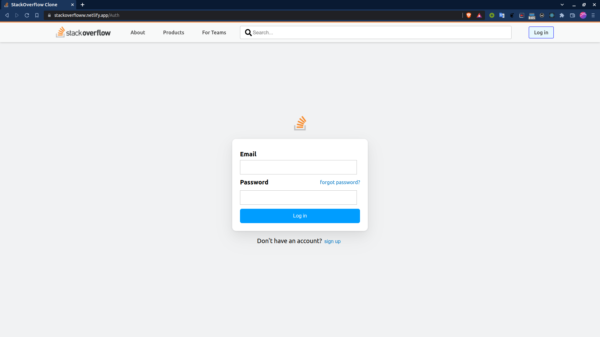
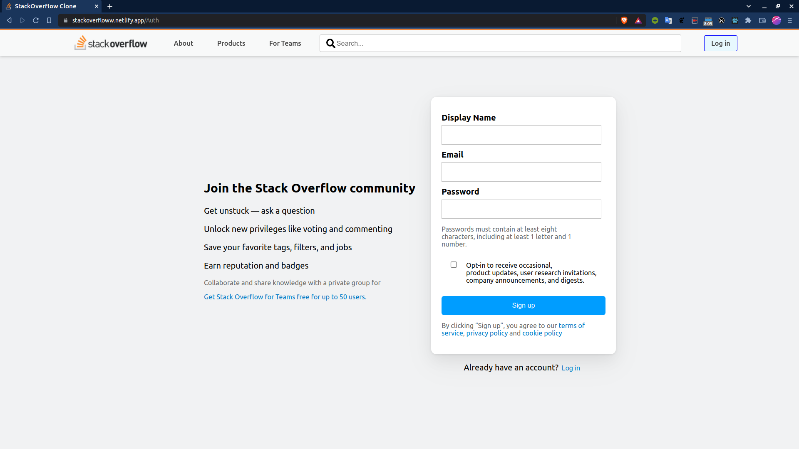
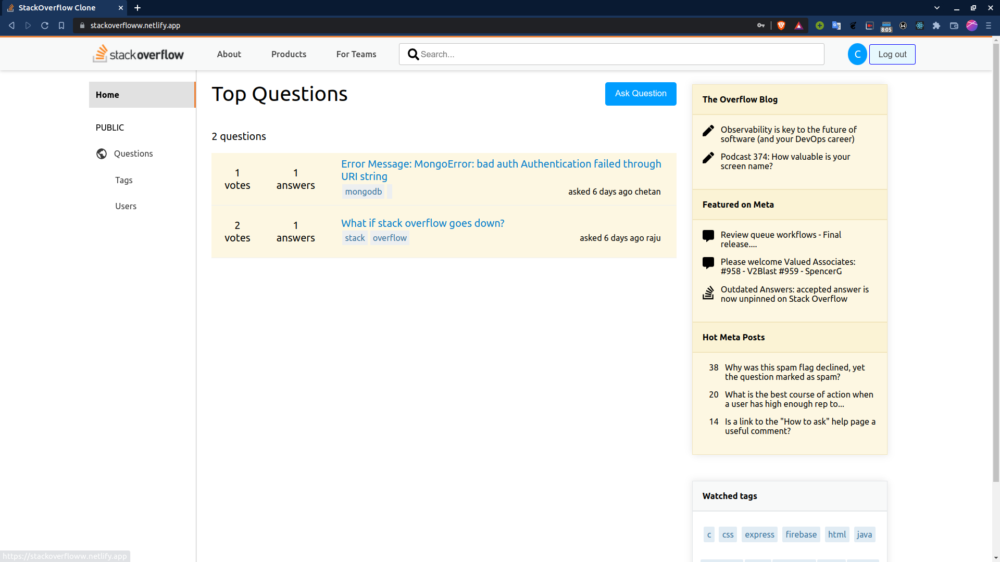
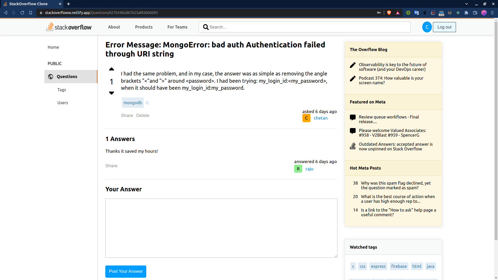
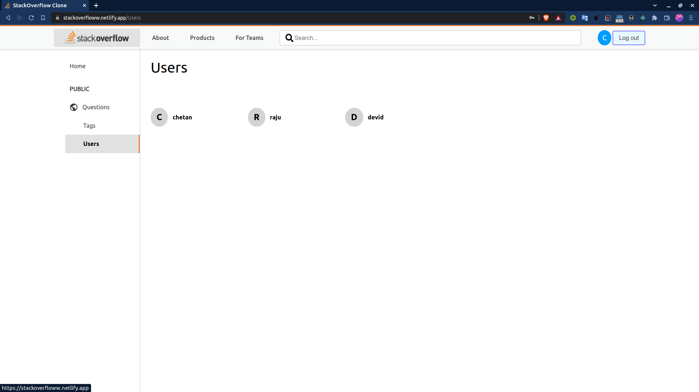
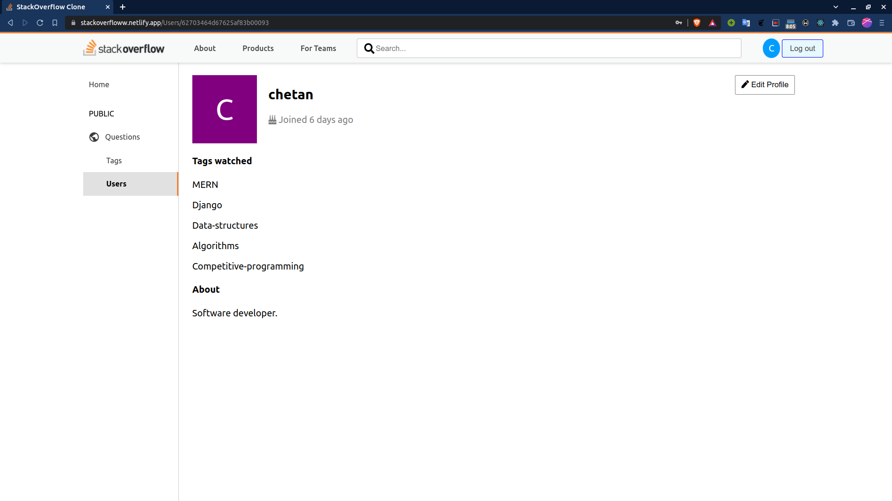

# stackoverfloww

**Head over to [stackoverfloww](https://stackoverfloww.netlify.app/) to find answers to your questions.**

### Available Scripts

`npm install`: use the above command on the server side and client side to install dependencies

`npm start`: use the above command on the server side and client side to run server

### Preview

Stay happy, Stay bug free!😉
